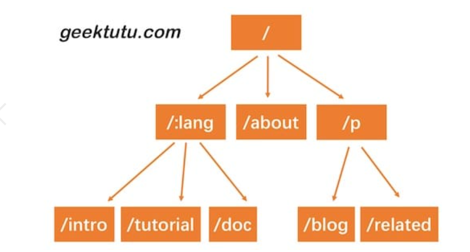

# Gee

version 1.0.0
实现了路由映射表，提供了用户注册静态路由的方法，包装了启动服务的函数

version 1.1.0
设计Context,针对使用场景，封装*http.Request和http.ResponseWriter的方法，
简化相关接口的调用，只是设计 Context 的原因之一。对于框架来说，还需要支撑额外的功能。
例如，将来解析动态路由/hello/:name，参数:name的值放在哪呢？再比如，框架需要支持中间件，
那中间件产生的信息放在哪呢？Context 随着每一个请求的出现而产生，请求的结束而销毁，
和当前请求强相关的信息都应由 Context 承载。因此，设计 Context 结构，扩展性和复杂性留在了内部，
而对外简化了接口。路由的处理函数，以及将要实现的中间件，参数都统一使用 Context 实例， 
Context 就像一次会话的百宝箱，可以找到任何东西。

version 1.2.0
之前，我们用了一个非常简单的map结构存储了路由表，使用map存储键值对，索引非常高效，但是有一个弊端，键值对的存储的方式，
只能用来索引静态路由。那如果我们想支持类似于/hello/:name这样的动态路由怎么办呢？所谓动态路由，
即一条路由规则可以匹配某一类型而非某一条固定的路由。例如/hello/:name，可以匹配/hello/geektutu、hello/jack等。
动态路由有很多种实现方式，支持的规则、性能等有很大的差异。例如开源的路由实现gorouter支持在路由规则中嵌入正则表达式，
例如/p/[0-9A-Za-z]+，即路径中的参数仅匹配数字和字母；另一个开源实现httprouter就不支持正则表达式。
著名的Web开源框架gin 在早期的版本，并没有实现自己的路由，而是直接使用了httprouter，
后来不知道什么原因，放弃了httprouter，自己实现了一个版本。
实现动态路由最常用的数据结构，被称为前缀树(Trie树)。看到名字你大概也能知道前缀树长啥样了：
每一个节点的所有的子节点都拥有相同的前缀。这种结构非常适用于路由匹配，比如我们定义了如下路由规则：

/:lang/doc

/:lang/tutorial

/:lang/intro

/about

/p/blog

/p/related

HTTP请求的路径恰好是由/分隔的多段构成的，因此，每一段可以作为前缀树的一个节点。我们通过树结构查询，如果中间某一层的节点都不满足条件，
那么就说明没有匹配到的路由，查询结束。
接下来我们实现的动态路由具备以下两个功能。
参数匹配:。例如 /p/:lang/doc，可以匹配 /p/c/doc 和 /p/go/doc。
通配*。例如 /static/*filepath，可以匹配/static/fav.ico，也可以匹配/static/js/jQuery.js，这种模式常用于静态服务器，能够递归地匹配子路径。

version 1.3.0
分组控制(Group Control)是 Web 框架应提供的基础功能之一。所谓分组，是指路由的分组。
如果没有路由分组，我们需要针对每一个路由进行控制。但是真实的业务场景中，往往某一组路由需要相似的处理。例如：

以/post开头的路由匿名可访问。

以/admin开头的路由需要鉴权。

以/api开头的路由是 RESTful 接口，可以对接第三方平台，需要三方平台鉴权。

大部分情况下的路由分组，是以相同的前缀来区分的。因此，我们今天实现的分组控制也是以前缀来区分，
并且支持分组的嵌套。例如/post是一个分组，/post/a和/post/b可以是该分组下的子分组。
作用在/post分组上的中间件(middleware)，也都会作用在子分组，子分组还可以应用自己特有的中间件。